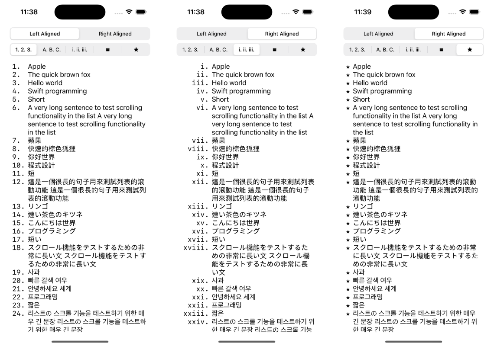

# FormattedListKit

A Swift package for creating and formatting ordered and unordered lists as `NSAttributedStrings` with precise control over markers and alignment.

## Features
- [x] Create ordered lists with various numbering styles (decimal, roman numerals, alphabetical)
- [x] Create unordered lists with different bullet styles (disc, circle, square, custom)
- [x] Control marker alignment (left or right aligned)
- [x] Proper indentation and alignment for wrapped text
- [x] Customizable font for list items
- [x] Monospaced markers for consistent alignment
- [x] Seamless integration with NSAttributedString

## Requirements
- iOS 13.0+ / macOS 10.15+
- Swift 5.5+

## Installation

### Swift Package Manager

Add FormattedListKit to your project using Swift Package Manager:

```swift
dependencies: [
    .package(url: "https://github.com/chiahsien/FormattedListKit.git", from: "1.0.0")
]
```

## Example
Check out the **Demo** project in `Example` folder.



## Usage

### Basic Usage

```swift
import FormattedListKit
import UIKit

// Create a simple ordered list
let items = ["First item", "Second item with longer text that will wrap", "Third item"]
let attributedString = NSAttributedString.createList(
    for: items,
    type: .ordered(style: .decimal)
)

// Set it to a UILabel or UITextView
myTextView.attributedText = attributedString
```

### Customizing List Styles

#### Ordered Lists

```swift
// Decimal numbers (1. 2. 3.)
let decimalList = NSAttributedString.createList(
    for: items,
    type: .ordered(style: .decimal)
)

// Lowercase Roman numerals (i. ii. iii.)
let romanList = NSAttributedString.createList(
    for: items,
    type: .ordered(style: .lowerRoman)
)

// Uppercase alphabetical (A. B. C.)
let alphaList = NSAttributedString.createList(
    for: items,
    type: .ordered(style: .upperAlpha)
)
```

#### Unordered Lists

```swift
// Bullet points (•)
let bulletList = NSAttributedString.createList(
    for: items,
    type: .unordered(style: .disc)
)

// Circles (◦)
let circleList = NSAttributedString.createList(
    for: items,
    type: .unordered(style: .circle)
)

// Custom marker (★)
let customList = NSAttributedString.createList(
    for: items,
    type: .unordered(style: .custom("★"))
)
```

### Customizing Appearance

```swift
// Custom font and marker alignment
let customList = NSAttributedString.createList(
    for: items,
    type: .ordered(style: .decimal),
    font: UIFont.systemFont(ofSize: 16, weight: .medium),
    markerAlignment: .left
)
```

## License

This library is released under the MIT license. See [LICENSE](License) for details.
